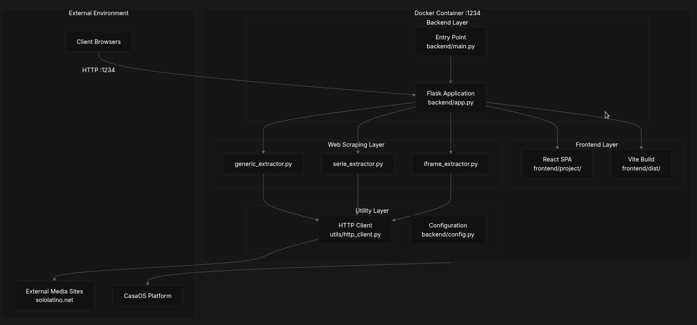

# Anxerstudios-Streaming Docs

## Descripción general

### Propósito y alcance

Este documento proporciona una descripción general de alto nivel de la aplicación Anxerstudios-Streaming, una plataforma de agregación de medios y web scraping en contenedores diseñada para la entrega de contenido en streaming. Esta descripción general cubre el propósito, la arquitectura, las tecnologías centrales y el modelo de implementación del sistema. Para obtener información detallada sobre subsistemas específicos, consulte [Arquitectura del sistema](./Arquitectura-del-sistema.md) Para detalles arquitectónicos, [Primeros pasos]() para instrucciones de configuración, y [Guía de implementación]() para estrategias de implementación de producción.

### Propósito del sistema

Anxerstudios-Streaming es una aplicación web completa que agrega contenido multimedia en streaming extrayend

La aplicación extrae metadatos de películas y series, listados de episodios y enlaces de transmisión de sitios externos, transformando HTML no estructurado en un catálogo estructurado accesible a través de una interfaz web responsiva. Todos los componentes se ejecutan en el puerto 1234, lo que proporciona un punto de acceso unificado tanto para la API como para la aplicación de una sola página.

### Características clave

| Caracterizar | Implementación |
| --- | --- |
| Arquitectura | Frasco de un solo contenedor + React SPA |
| Web Scrapping | Sistema extractor modular con BeautifulSoup4 |
| Frontend | React 18 con sistema de compilación Vite |
| Backend | Servidor API de Flask con puntos finales RESTful |
| Implementación | Containerización de Docker dirigida a CasaOS |
| Configuración del puerto | Puerto único 1234 para todos los servicios |
| Enrutamiento | Limpiar URL con React Router (/page/1, /page/2) |
| Tipos de contenido | Películas, series de televisión y anime |

### Descripción general de la arquitectura del sistema

La aplicación sigue una arquitectura de tres niveles con una clara separación entre las capas de presentación, lógica de la aplicación y extracción de datos.

### Diagrama de componentes de alto nivel

### Mapeo de entidades de código del punto final de API

## Pila de tecnología

La aplicación aprovecha tecnologías web modernas optimizadas para la implementación en contenedores:

### Tecnologías básicas

|Capa|Tecnología|Propósito|Archivos clave|
|---|---|---|---|
|Contenedor|Docker|Despliegue de un solo contenedor|docker/Dockerfile|
|Marco de backend|Matraz|Servidor API RESTful|backend/app.py|
|Marco frontend|Reaccionar 18|Interfaz de usuario|frontend/project/|
|Construir sistema|Vite|Compilación de frontend|frontend/project/dist/|
|Raspado web|Hermosa sopa4|Análisis de HTML|backend/extractors/|
|Cliente HTTP|Solicitudes de Python|Comunicación externa del sitio|backend/utils/|

## Proceso de construcción en varias etapas

## Modelo de implementación

Anxerstudios-Streaming está diseñado para la implementación de un solo contenedor en entornos de servidores domésticos, particularmente CasaOS. La aplicación Flask sirve tanto a React SPA como a la API backend en el puerto 1234, eliminando la necesidad de servidores web separados o servidores proxy inversos.

### Configuración del contenedor
- Imágenes base: node:20-alpine Para la compilación del frontend, python:3.11-slim para tiempo de ejecución
- Exposición portuaria: Puerto único 1234 para todos los servicios
- Punto de entrada:\
- inicia Flask con host='0.0.0.0', port="1234"
- Comando de compilación: docker build -t peliculas-casaos .
- Ejecutar comando: docker run -d --name peliculas -p 1234:1234 peliculas-casaos

## Integración de CasaOS
La aplicación se integra con CasaOS a través de la gestión estándar de contenedores Docker, proporcionando un servicio de transmisión basado en web accesible a través de la red local. El enfoque en contenedores garantiza una implementación consistente independientemente del sistema host subyacente.